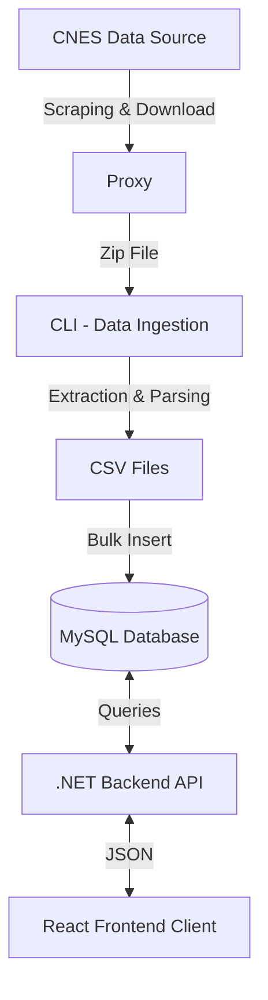

# Project Health

> 🇧🇷 [Leia isto em Português](README.pt-BR.md)
>
> ## Link to published website: https://saudelocaliza.com.br

## Overview

**Project Health** is a complete solution for extracting, processing, and visualizing health establishment data (CNES - National Register of Health Establishments). The project features a robust architecture ranging from automated public data collection to a user-friendly presentation for the end user.

The system monitors official data sources, downloads updated databases (ZIP files containing CSVs), processes this information by inserting it into a relational database, and makes it all available through a high-performance API and a modern Frontend.

## System Architecture

The project is divided into 4 main components working together:

1.  **CLI (Data Ingestion)**: Responsible for ETL (Extract, Transform, Load).
2.  **Proxy**: Intermediate service to bypass network restrictions during scraping.
3.  **Backend (API)**: RESTful interface for consuming processed data.
4.  **Frontend (Web App)**: Graphical interface for users to search and view establishments.

### Data Flow



---

## Detailed Components

### 1. CLI (Data Ingestion)

Located in `/cli`.
A **TypeScript** application focused on automation.

- **Functionality**:
  - Accesses the CNES statistics portal via `Puppeteer`.
  - Identifies the latest data file (usually `BASE_DE_DADOS_CNES_YYYYMM.ZIP`).
  - Downloads and unzips the file.
  - Processes massive CSV files using streams.
  - Inserts normalized data into the MySQL database.
- **Stack**: Node.js, TypeScript, Puppeteer, MySQL2, Node-cron.

### 2. Proxy

Located in `/proxy`.
A simple **Node.js/Express** server.

- **Functionality**: Acts as a facilitator for the CLI or Frontend to access external resources that may have CORS blocks or SSL certificate issues. Uses the `unblocker` library.
- **Port**: 3000

### 3. Backend (API)

Located in `/backend`.
A Web API built in **.NET 6+**.

- **Functionality**: Exposes endpoints for data querying.
- **Main Endpoints**:
  - `PUT /Home/Search`: Complex search with filters by name, establishment type, and city.
  - `GET /Stablishment/{susId}`: Complete details of a specific establishment.
  - `GET /Home/Types`: Lists unit types.
  - `GET /Home/Cities`: Lists available cities.
- **Architecture**: Simplified Clean Architecture (Controllers -> UseCases -> Repositories).
- **Stack**: C#, ASP.NET Core, MySql.Data.

### 4. Frontend (Web App)

Located in `/frontend`.
An SPA application built with **React**.

- **Functionality**: Allows users to search for health establishments, filter by location and type, and view details such as opening hours and available services.
- **Stack**: React, Vite, TypeScript, TailwindCSS (likely), React Router, React Query.

---

## Prerequisites

- **Node.js** (v18 or higher)
- **Dotnet SDK** (.NET 6.0 or higher)
- **MySQL Server** (with a created database)

## Installation and Execution

To run the full project locally, you will need to start services in separate terminals.

### Step 0: Database Configuration

Ensure you have a MySQL instance running. Configure connection strings in the files:

- `backend/API/appsettings.Development.json`
- `cli/src/app.config.ts` (or corresponding environment variables)

### Step 1: Start the Proxy

```bash
cd proxy
npm install
node index.js
```

_The proxy will run on port 3000._

### Step 2: Populate the Database (CLI)

This step may take a while as it involves downloading and processing large files.

```bash
cd cli
npm install
npm run dev
```

_The script will start the scraping, download, and database insertion process._

### Step 3: Start the Backend

```bash
cd backend/API
dotnet restore
dotnet run
```

_The API will be available (likely at `https://localhost:7198` or similar, check the log)._

### Step 4: Start the Frontend

```bash
cd frontend
npm install
npm run dev
```

_Access the application in the browser through the link provided by Vite (e.g., `http://localhost:5173`)._

---

## Design Decisions

- **Separation of Concerns**: The data ingestion process (heavy and time-consuming) was decoupled from the read API. This ensures the API remains fast even during database updates.
- **Use of Streams**: The CLI uses stream file reading (CSV Parser) to handle large data volumes without exhausting RAM.
- **Clean Architecture in Backend**: Facilitates maintenance and testing by separating business logic (Cases) from data access (Repositories).
- **Proxy for Resilience**: Using an intermediate proxy helps avoid connection failures with unstable government sources or legacy security configurations.

## Folder Structure

```
projectHealth2/
├── backend/          # .NET Solution
│   └── API/          # Web API Project
├── cli/              # Data import tool
│   └── src/          # TypeScript source code
├── frontend/         # React Application
│   └── src/          # Components, Pages, and Hooks
├── proxy/            # Node.js Proxy Server
└── README.md         # Project documentation (English)
```
