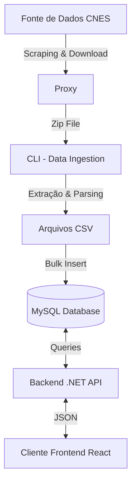

# Project Health

## Visão Geral

**Project Health** é uma solução completa para extração, processamento e visualização de dados de estabelecimentos de saúde (CNES - Cadastro Nacional de Estabelecimentos de Saúde). O projeto é composto por uma arquitetura robusta que vai desde a coleta automatizada de dados públicos até a apresentação amigável ao usuário final.

O sistema monitora fontes de dados oficiais, baixa bases de dados atualizadas (arquivos ZIP contendo CSVs), processa essas informações inserindo-as em um banco de dados relacional e disponibiliza tudo através de uma API de alta performance e um Frontend moderno.

## Arquitetura do Sistema

O projeto é dividido em 4 componentes principais que trabalham em conjunto:

1.  **CLI (Ingestão de Dados)**: Responsável pelo ETL (Extract, Transform, Load).
2.  **Proxy**: Serviço intermediário para contornar restrições de rede durante o scraping.
3.  **Backend (API)**: Interface RESTful para consumo dos dados processados.
4.  **Frontend (Web App)**: Interface gráfica para usuários pesquisarem e visualizarem estabelecimentos.

### Fluxo de Dados



---

## Componentes Detalhados

### 1. CLI (Data Ingestion)

Localizado na pasta `/cli`.
Uma aplicação **TypeScript** focada em automação.

- **Funcionalidade**:
  - Acessa o portal de estatísticas do CNES via `Puppeteer`.
  - Identifica o arquivo de dados mais recente (geralmente `BASE_DE_DADOS_CNES_YYYYMM.ZIP`).
  - Realiza o download e descompactação do arquivo.
  - Processa arquivos CSV gigantescos usando streams.
  - Insere os dados normalizados no banco de dados MySQL.
- **Stack**: Node.js, TypeScript, Puppeteer, MySQL2, Node-cron.

### 2. Proxy

Localizado na pasta `/proxy`.
Um servidor **Node.js/Express** simples.

- **Funcionalidade**: Atua como um facilitador para o CLI ou Frontend acessarem recursos externos que podem ter bloqueios de CORS ou problemas de certificado SSL. Utiliza a biblioteca `unblocker`.
- **Porta**: 3000

### 3. Backend (API)

Localizado na pasta `/backend`.
Uma Web API construída em **.NET 6+**.

- **Funcionalidade**: Expõe endpoints para consulta de dados.
- **Endpoints Principais**:
  - `PUT /Home/Search`: Busca complexa com filtros por nome, tipo de estabelecimento e cidade.
  - `GET /Stablishment/{susId}`: Detalhes completos de um estabelecimento específico.
  - `GET /Home/Types`: Lista tipos de unidades.
  - `GET /Home/Cities`: Lista cidades disponíveis.
- **Arquitetura**: Clean Architecture simplificada (Controllers -> UseCases -> Repositories).
- **Stack**: C#, ASP.NET Core, MySql.Data.

### 4. Frontend (Web App)

Localizado na pasta `/frontend`.
Uma aplicação SPA construída com **React**.

- **Funcionalidade**: Permite aos usuários buscar estabelecimentos de saúde, filtrar por localização e tipo, e visualizar detalhes como horário de funcionamento e serviços disponíveis.
- **Stack**: React, Vite, TypeScript, TailwindCSS (provável), React Router, React Query.

---

## Pré-requisitos

- **Node.js** (v18 ou superior)
- **Dotnet SDK** (.NET 6.0 ou superior)
- **MySQL Server** (com um banco de dados criado)

## Instalação e Execução

Para rodar o projeto completo localmente, você precisará iniciar os serviços em terminais separados.

### Passo 0: Configuração do Banco de Dados

Certifique-se de ter uma instância MySQL rodando. Configure as strings de conexão nos arquivos:

- `backend/API/appsettings.Development.json`
- `cli/src/app.config.ts` (ou variáveis de ambiente correspondentes)

### Passo 1: Iniciar o Proxy

```bash
cd proxy
npm install
node index.js
```

_O proxy rodará na porta 3000._

### Passo 2: Popular o Banco de Dados (CLI)

Este passo pode demorar, pois envolve baixar e processar arquivos grandes.

```bash
cd cli
npm install
npm run dev
```

_O script irá iniciar o processo de scraping, download e inserção no banco._

### Passo 3: Iniciar o Backend

```bash
cd backend/API
dotnet restore
dotnet run
```

_A API estará disponível (provavelmente em `https://localhost:7198` ou similar, verifique o log)._

### Passo 4: Iniciar o Frontend

```bash
cd frontend
npm install
npm run dev
```

_Acesse a aplicação no navegador através do link fornecido pelo Vite (ex: `http://localhost:5173`)._

---

## Decisões de Design

- **Separação de Responsabilidades**: O processo de ingestão de dados (pesado e demorado) foi desacoplado da API de leitura. Isso garante que a API permaneça rápida mesmo durante a atualização da base de dados.
- **Uso de Streams**: O CLI utiliza leitura de arquivos por stream (CSV Parser) para manipular grandes volumes de dados sem estourar a memória RAM.
- **Clean Architecture no Backend**: Facilita a manutenção e testes, separando a lógica de negócios (Cases) do acesso a dados (Repositories).
- **Proxy para Resilience**: O uso de um proxy intermediário ajuda a evitar falhas de conexão com fontes governamentais instáveis ou com configurações de segurança legadas.

## Estrutura de Pastas

```
projectHealth2/
├── backend/          # Solução .NET
│   └── API/          # Projeto Web API
├── cli/              # Ferramenta de importação de dados
│   └── src/          # Código fonte TypeScript
├── frontend/         # Aplicação React
│   └── src/          # Componentes, Páginas e Hooks
├── proxy/            # Servidor Proxy Node.js
└── README.md         # Documentação do projeto
```
